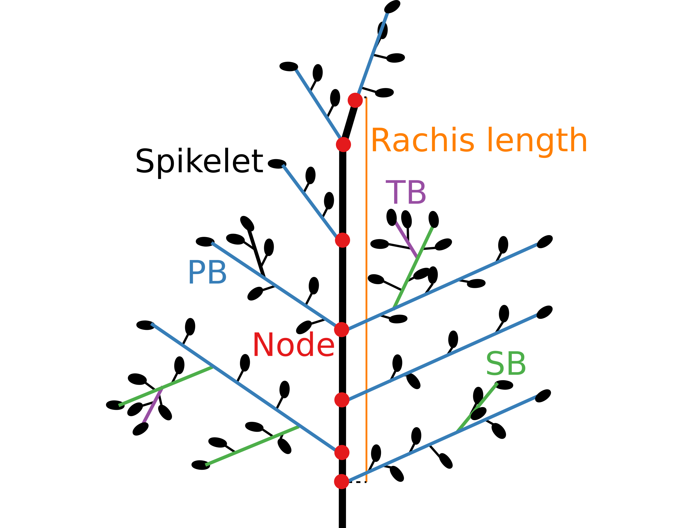
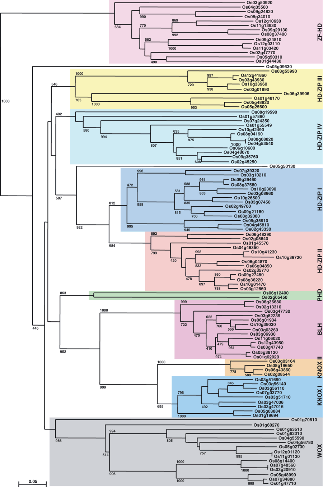
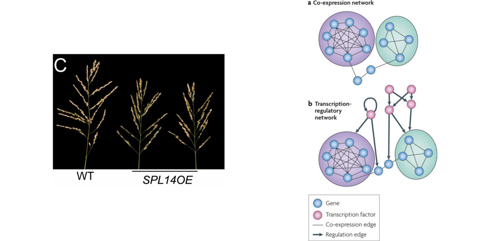
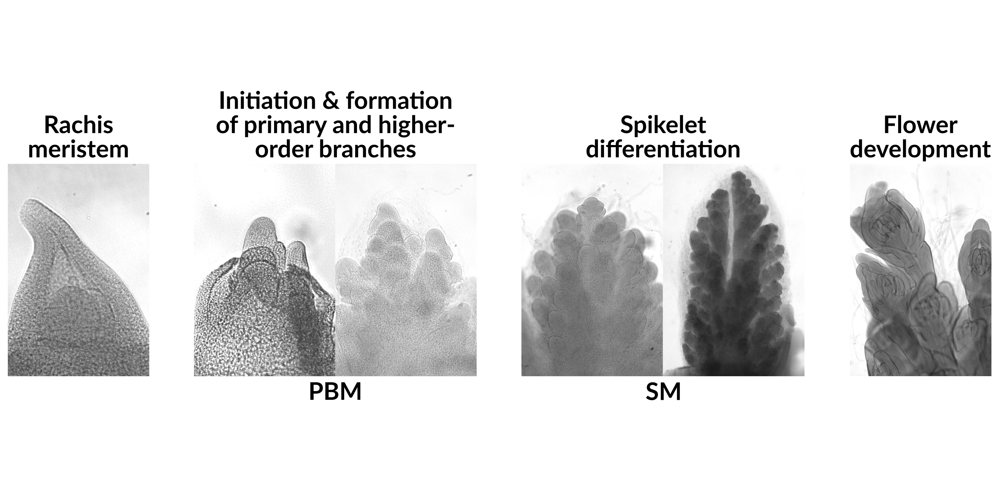

```{r setup, include=FALSE, results="hide"}

library(ggplot2)

# Default resolution is 96 dpi. Higher dpi can be used in R but the figures have to be resized using css.
# For proper scaling in the html, the figures should be:
# w    x    h
# 879       432  px
# 9.16      4.5  in
# for slides with subtitles:
# w    x    h
# 879       362  px
# 9.16      3.77  in
#
# the smaller figure is not quite right, try 432 px - 48 px - (45 px / 2)
# 48 px = space taken by the h3 (subtitle)
# 45 px = margin added to slide > article 

theme_slide <- theme_grey(base_size = 16, base_family = "Lato") +
  theme(
    plot.background = element_rect(fill = "transparent", colour = NA),
    legend.background = element_rect(fill = "transparent", colour = NA))
knitr::opts_chunk$set(
  dev.args=list(bg = "transparent", family = "Lato"),
  echo = FALSE,
  message = FALSE,
  warning = FALSE,
  dpi = 300,
  cache = TRUE)
source("src/plots.R")
```

## Rice facts

*  **IRD people know this stuff**

## Rice inflorescence architecture



## Branching complexity is related to yield

```{r ptypes2}
print(ptypes2)
```

## Meristem identities


## Meristem transitions & branching | *TAWAWA1* / *G1 LIKE PROTEIN 5*

```{r taw, fig.height = 3.77}
my.img <- png::readPNG("img/taw.png")
grid::grid.raster(my.img)
```

<footer class="source2">Yoshida <em>et al</em>., 2013. <a href="http://www.pnas.org/content/110/2/767.full">10.1073/pnas.1216151110</a></footer>

## Meristem transitions & branching | *LONELY GUY 1*

```{r log1, fig.height = 3.77}
my.img <- png::readPNG("img/log1.png")
grid::grid.raster(my.img)
```

<footer class="source2">Kurakawa <em>et al</em>., 2007 <a href="http://www.nature.com/nature/journal/v445/n7128/full/nature05504.html">10.1038/nature05504</a></footer>

## Laser microdissection (LMD)


## LMD & RNA sequencing

```{r lmd.quant.table, results = 'markup'}
knitr::kable(lmd.quant.table[!is.na(`Reads in genes (M)`)],
             format = "markdown",
             align = c("r", rep("l", dim(lmd.quant.table)[2] - 1)))
```

## rRNA contamination

```{r lmd.ribosomal}
print(lmd.ribosomal)
```

## Gene coexpression

```{r mfuzz}
print(mfuzzClusters)
```

## Gene coexpression

```{r cluster.tfs}
cluster.tfs
```

## G1-Like (ALOG) genes

```{r alog}
print(alog)
```

## Geneset enrichment

```{r gsea}
gsea
```

## Homeobox genes



<footer class="source2">Jain <em>et al</em>., 2008 <a href="http://onlinelibrary.wiley.com/doi/10.1111/j.1742-4658.2008.06424.x/full">10.1111/j.1742-4658.2008.06424.x</a></footer>

## Class III & IV HD-Zip genes

```{r hdzip}
print(hdzip)
``` 

##  Applications 



<footer class="source2">Wang <em>et al</em>., 2015 <a href="http://www.pnas.org/content/112/50/15504.long">10.1073/pnas.1521949112</a><br>Smet & Marchal, 2010 <a href="http://www.nature.com/nrmicro/journal/v8/n10/full/nrmicro2419.html">10.1038/nrmicro2419</a></footer>

## Diversity in panicle architecture


## Diversity in panicle architecture

```{r accessions}
print(acc.pheno)
```

## Sampling

| **Species**              | **Accession** | **Continent** | **Type**     | **Dev. stage** |
| -----------------------: | :----         | :---------    | :-------     | :----------    |
| *O. rufipogon*           | W1654         | Asia          | Wild         | PBM            |
| *O. rufipogon*           | W1654         | Asia          | Wild         | SM             |
| *O. sativa japonica*     | Nipponbare    | Asia          | Domesticated | PBM            |
| *O. sativa japonica*     | Nipponbare    | Asia          | Domesticated | SM             |
| *O. sativa indica*       | IR64          | Asia          | Domesticated | PBM            |
| *O. sativa indica*       | IR64          | Asia          | Domesticated | SM             |
| *O. barthii*             | B88           | Africa        | Wild         | PBM            |
| *O. barthii*             | B88           | Africa        | Wild         | SM             |
| *O. glaberrima*          | Tog5681       | Africa        | Domesticated | PBM            |
| *O. glaberrima*          | Tog5681       | Africa        | Domesticated | SM             |

## Sampling



## Mapping to *O. sativa japonica* Nipponbare genome

```{r statplot.5ac}
print(statplot.5ac)
```

## Basic molecular mechanisms | `r n.sig.stage` genes

```{r stage.genes, fig.height = 3.77}
print(stage.genes)
```

## Structural variation between species

```{r struc1, fig.height = 4.5/2, results='asis'}
print(struct1)
cat("<br>")
print(struct2)
```

## Structural variation between species

```{r struc2, fig.height = 4.5/2, results="asis"}
print(struct3)
cat("<br>")
print(struct4)
```

## Structural variation between species

| Contrast                                | *p* < 0.05    |
| ---:                                    | :----         |
| *O. glaberrima* vs. *O. barthii*        | 495           |
| *O. sativa indica* vs. *O. rufipogon*   | 1169          |
| *O. sativa japonica* vs. *O. indica*    | 1680          |
| *O. sativa japonica* vs. *O. rufipogon* | 1441          |

## Domestication of Asian rice

```{r as}
print(as.genes)
```

## Domestication of African rice

```{r af, fig.width=9.16/2}
print(af2.genes)
print(af1.genes)
```

## Parallel evolution

```{r dom}
print(dom.genes)
```

## Genomic support


<footer class="source2">The 3,000 rice genomes project, 2014 <a href="http://gigascience.biomedcentral.com/articles/10.1186/2047-217X-3-7">10.1186/2047-217X-3-7</a></footer>

## Mention some other approaches for the data

*   comment about GWAS
*   genomic data for SNPs and transposable elements
*   structural variation in genes

## Acknowledgements

*  **EDI team & IRD**
*  **Kater Lab, Università degli Studi di Milano, Italy**


